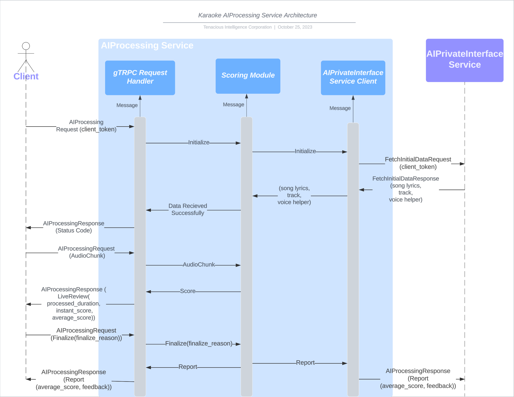

# Karaoke Scoring System 🎤🎶

## Overview 🌐

A real-time Karaoke Scoring System built on gRPC that evaluates singing performances. Featuring a primary gRPC server, `AIProcessingService`, which communicates with clients and an existing service, `AIPrivateInterfaceService`, for analytics and scoring.

## Table of Contents 📑

- [Getting Started](#getting-started-🚀)
  - [Prerequisites](#prerequisites-📋)
  - [Installation](#installation-🛠️)
- [Configuration](#configuration-⚙️)
- [System Architecture](#system-architecture-🏗️)
- [Scoring Module](#scoring-module-🎯)
- [Usage](#usage-🔨)
- [Folder Structure](#folder-structure-📂)
- [Contributing](#contributing-🤝)
- [License](#license-📄)

## Getting Started 🚀

### Prerequisites 📋

- Docker
- Python 3.x
- gRPC
- OpenSSL

### Installation 🛠️

#### Protocol Generation 💽

Generate Python protocol files based on the given `.proto` files:

```bash
rm -r ./proto/Generated
docker build -t grpc-builder -f Dockerfile.grpcgen .
docker run --name grpc-temp grpc-builder /bin/true
docker cp grpc-temp:/app/Generated ./proto
docker rm grpc-temp
```

#### Building Docker Images 🐳

Build the Docker image for `AIProcessingService`:

```bash
docker-compose build aiprocessing-service
```

#### Creating Self-Signed Certificates 🔒

Generate the self-signed certificates:

```bash
openssl req -x509 -newkey rsa:4096 -keyout private.pem -out certificate.pem -days 365 -nodes -subj '/CN=ec2-16-171-36-141.eu-north-1.compute.amazonaws.com'
```

## Configuration ⚙️

The system uses a combination of `.env` and `config.yaml` files to manage configurations. These files are loaded at the start of the application by a singleton class named `config.py`.

### .env File 📄

The `.env` file stores essential environment variables such as API keys, gRPC server settings, and other sensitive information. To infer the required variables, you can refer to the `config.py` file.

### config.yaml File 📜

The `config.yaml` file contains more structured configurations, including scoring weights, scoring functions, preprocessing pipeline steps, and feedback messages for each scoring metric.

Example:

```yaml
ScoreWeights:
  linguistic_accuracy_score: 0.2
  linguistic_similarity_score: 0.2
  ...
```

### config.py 🐍

The `config.py` is a singleton class responsible for loading both `.env` and `config.yaml` files. It throws an error if either of the files is not found.

Here's a simplified example of how it loads configurations:

```python
class Config:
    def __new__(cls):
        ...
    def init_config(self) -> None:
        load_dotenv()
        self.OPENAI_API_KEY = self._get_env_variable("OPENAI_API_KEY")
        ...
        try:
            with open("config.yaml", "r") as stream:
                config_data = yaml.safe_load(stream)
                self.SCORE_WEIGHTS = config_data.get("ScoreWeights", {})
                ...
        except FileNotFoundError:
            logging.error("🚨 config.yaml file not found.")
```

#### Important Note 🚨

Please make sure to place the `.env` and `config.yaml` files in the appropriate directories as expected by the `config.py`.

## System Architecture 🏗️



### AIProcessingService

The AIProcessingService receives audio chunks from clients and coordinates with AIPrivateInterfaceService to get essential data like lyrics and original audio. It uses the Scoring module to evaluate each audio chunk and provides real-time updates to the client. When the client sends a "finalize" request, it calculates the average score and feedback to send back to both the client and AIPrivateInterfaceService.

### AIPrivateInterfaceService

This existing gRPC service provides the AIProcessingService with lyrics, original singer's audio, and the instrumental track for the song.

### Scoring Module 🎯

The Scoring module, built meticulously to evaluate singing performances, uses advanced techniques like Dynamic Time Warping (DTW), Google's Speech Transcription, and audio preprocessing strategies to give accurate scores. It also includes a Jupyter Notebook for experimentation.

#### Key Components:

- **KaraokeData**: Central class for storing and processing song-specific data.
- **AudioPreprocessor**: Class for refining the user's audio using techniques like normalization, silence trimming, etc.
- **Scoring Mechanisms**: Uses diverse metrics like Linguistic Accuracy Score, Amplitude Matching Score, and Pitch Matching Score for evaluation.

## Usage 🔨

Start `AIProcessingService` with the following command:

```bash
docker-compose up aiprocessing-service
```

## Folder Structure 📂

```
├── AIPrivateInterfaceService
├── AIProcessingService
│   ├── .env
│   ├── ai_private_interface_service_client.py
│   ├── ai_processing_service.py
│   ├── audio_processor.py
│   ├── config.py
│   ├── data_loader.py
│   └── ... (other files)
├── Scoring
│   ├── audio_preprocessor.py
│   ├── audio_score.ipynb
│   ├── audio_scorer.py
│   └── ... (other files)
├── client
├── proto
│   ├── Declarations
│   ├── Generated
│   └── generate.sh
├── Dockerfile.aiprivateinterface
├── Dockerfile.aiprocessing
├── Dockerfile.client
├── Dockerfile.grpcgen
├── README.md
├── docker-compose.yml
└── pyproject.toml
```

## Contributing 🤝

(TBD)

## License 📄

(TBD)
